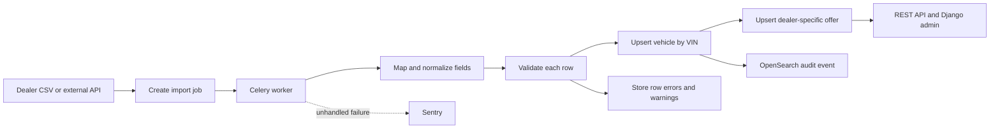
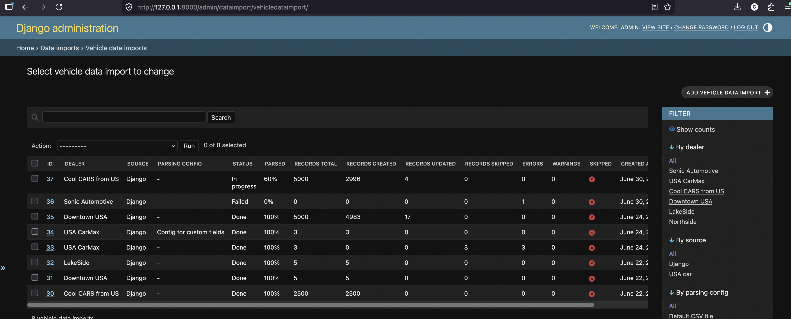
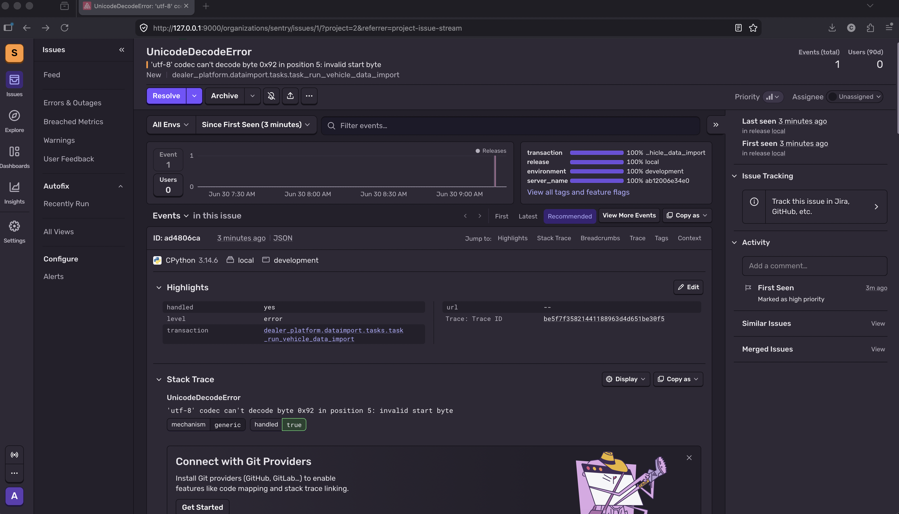
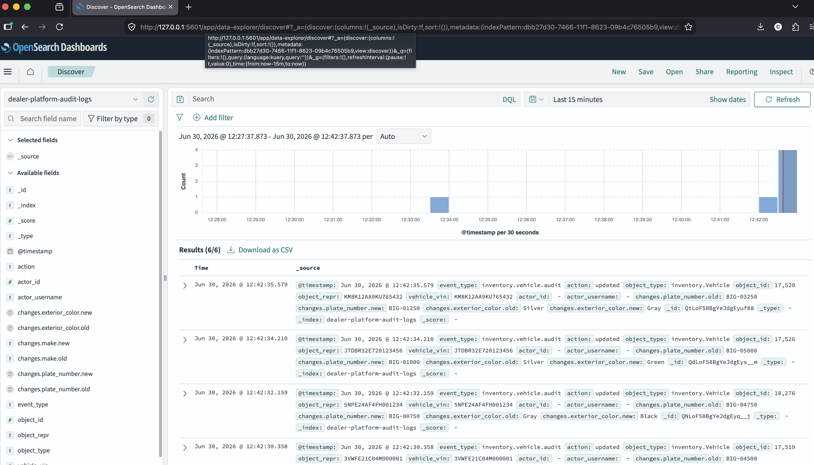

# Dealer Integration Platform

A demo backend for collecting vehicle inventory from different dealers,
converting it into one consistent data model, and exposing it through an
authenticated REST API.

The project demonstrates how an integration service can accept both CSV files
and external API data, process imports asynchronously, preserve
dealer-specific prices, and make failures and data changes observable.

> This is a portfolio/demo project. It contains no proprietary code or
> production credentials.

## What this project demonstrates

- Designing a versioned REST API with Django REST Framework
- Documenting and testing an API with OpenAPI and Swagger UI
- Securing API endpoints with JWT access and refresh tokens
- Processing long-running imports asynchronously with Celery and Redis
- Integrating differently shaped CSV and third-party API feeds
- Mapping source-specific fields and codes to a canonical vehicle model
- Validating rows while preserving import errors, warnings, and progress
- Modeling shared vehicles and dealer-specific prices in PostgreSQL
- Recording vehicle changes as structured audit events in OpenSearch
- Monitoring unhandled Django and Celery errors with Sentry
- Running the complete development stack with Docker Compose
- Maintaining quality with pytest, Black, isort, Flake8, and mypy

## Business flow

Each dealer can describe the same vehicle differently and offer it at a
different price. The platform separates the shared vehicle identity from the
dealer's commercial offer, then normalizes every source into that model.



In practical terms:

1. A dealer sends a CSV feed, or the USA Car adapter fetches inventory from an
   external API.
2. The original data is stored and a vehicle import job is created.
3. A Celery worker maps custom columns and source codes to standard fields.
4. Each row is validated. Invalid rows are recorded without hiding the rest of
   the import result.
5. Vehicles are created or updated by VIN. A separate dealer offer stores the
   price and currency for that dealer.
6. Import totals, progress, warnings, and errors are visible in Django admin.
7. Authenticated clients manage inventory through the REST API. Vehicle
   changes are also written to OpenSearch for auditability.

## Developed features

### Inventory and integrations

- Vehicle, dealer, and dealer-offer domain models
- Idempotent vehicle and offer updates
- Standard CSV imports
- Configurable custom CSV column mappings and ignored columns
- USA Car API client with authentication, retries, code translation, and CSV
  archival
- Per-row validation, warnings, errors, and import counters
- Dealer-filtered inventory exports from Django admin

### API and administration

- JWT authentication: obtain, refresh, and verify tokens
- Vehicle CRUD endpoints
- Read-only dealer endpoints
- Dealer-offer create, read, update, and delete endpoint
- Pagination and consistent serializers
- OpenAPI schema and interactive Swagger UI
- Django admin for inventory, imports, parsing rules, files, and integration
  configuration
- Health-check endpoint

### Background processing and observability

- Celery workers with Redis as broker and result backend
- PostgreSQL persistence
- Structured OpenSearch audit events for vehicle create, update, and delete
- Field-level before/after values in update events
- Authenticated actor details in API-generated audit events
- Sentry integration for unhandled Django and Celery exceptions
- Explicit Sentry reporting for fatal import failures
- Dockerized local environment
- Automated tests, formatting, linting, and static type checking

## Quick start

### Requirements

- Git
- Make
- Docker with Docker Compose

### 1. Clone and start the project

```bash
git clone <repository-url>
cd dealer-integration-platform
make up
```

`make up` runs the required Docker Compose build and startup command. That is
the complete startup path: Docker builds the application, starts all services,
waits for their dependencies, and applies database migrations automatically.
No local Python or PostgreSQL installation is required.

Wait until Django reports that the development server is running, then open:

| URL | Purpose |
| --- | --- |
| <http://localhost:8000/health/> | Application health check |
| <http://localhost:8000/swagger/> | Interactive API documentation |
| <http://localhost:8000/admin/> | Django administration |
| <http://localhost:5601/> | OpenSearch Dashboards |

Use `Ctrl+C` to stop the foreground stack. Start it in the background with
`docker compose up --build -d`, and stop it later with
`docker compose down`.

### 2. Create an administrator

The application is running after step 1. To use the protected API and Django
admin, open a second terminal and create a user:

```bash
make superuser
```

Sign in at <http://localhost:8000/admin/> with that username and password.

### 3. Explore the API

Request a JWT:

```bash
curl -X POST http://localhost:8000/api/v1/auth/token/ \
  -H "Content-Type: application/json" \
  -d '{"username":"your-username","password":"your-password"}'
```

Copy the returned `access` value and use it in a request:

```bash
curl http://localhost:8000/api/v1/vehicles/ \
  -H "Authorization: Bearer your-access-token"
```

For an interactive demo, open <http://localhost:8000/swagger/>, select
**Authorize**, and paste the access token. Swagger lists every request body,
response, and available endpoint.

The browsable API uses a Django session instead of a pasted JWT. Sign in at
<http://localhost:8000/api-auth/login/> to use it.

## Try a vehicle import

Sample feeds are included in [`examples/csv`](examples/csv), including
standard columns, custom dealer columns, shared VINs, and a 2,500-row file.

1. Sign in to Django admin.
2. Create a **Dealer**.
3. Add a **File** and upload a sample CSV.
4. Add a **Vehicle data import**, select the dealer and file, and use the
   `Django` source.
5. Save the import. Celery processes it in the background.
6. Refresh the import record to inspect its status, counters, warnings, and
   row-level errors.
7. Open **Vehicles** to see normalized inventory and dealer offers.



For a feed with non-standard headers, first create a **Vehicle data import
parsing config** and map its source columns to the canonical fields. More
details about the supplied fixtures are in
[`examples/README.md`](examples/README.md).

## API overview

All inventory endpoints require JWT or session authentication.

| Method | Endpoint | Purpose |
| --- | --- | --- |
| `POST` | `/api/v1/auth/token/` | Obtain access and refresh tokens |
| `POST` | `/api/v1/auth/token/refresh/` | Refresh an access token |
| `POST` | `/api/v1/auth/token/verify/` | Verify a token |
| `GET` | `/api/v1/dealers/` | List dealers |
| `GET` | `/api/v1/dealers/{id}/` | Retrieve a dealer |
| `GET`, `POST` | `/api/v1/vehicles/` | List or create vehicles |
| `GET`, `PUT`, `PATCH`, `DELETE` | `/api/v1/vehicles/{id}/` | Manage a vehicle |
| `GET`, `POST`, `PATCH`, `DELETE` | `/api/v1/vehicles/{vehicle_id}/dealers/{dealer_id}/offer/` | Manage one dealer offer |

The machine-readable OpenAPI schema is available at
<http://localhost:8000/swagger/v1/swagger.json>.

## Services

| Service | Responsibility | Local port |
| --- | --- | --- |
| `web` | Django API and admin | `8000` |
| `celery` | Asynchronous import processing | — |
| `db` | PostgreSQL database | `5432` |
| `redis` | Celery broker and result backend | `6379` |
| `opensearch` | Structured vehicle audit events | `9200` |
| `opensearch-dashboards` | Audit-event exploration UI | `5601` |

PostgreSQL data is retained in `.postgres_data` between container restarts.

## Configuration

The Docker defaults work without an environment file. To customize them:

```bash
cp .env.example .env
```

The example file documents database, Celery, OpenSearch, Django, and Sentry
settings. Values in `.env` override the development defaults in
`docker-compose.yml`.

### Sentry error monitoring

Sentry is optional and disabled when `SENTRY_DSN` is empty. Create a Sentry
Python project, then set these values in `.env` and restart the stack:

```text
SENTRY_DSN=https://public-key@your-sentry-host/project-id
SENTRY_ENVIRONMENT=development
SENTRY_RELEASE=dealer-platform@local
SENTRY_TRACES_SAMPLE_RATE=0.0
```

The integration covers both Django requests and Celery tasks. Performance
tracing is disabled by default, and personally identifiable information is not
sent automatically.

To send a diagnostic event:

```bash
docker compose exec web python manage.py shell -c \
  'import sentry_sdk; sentry_sdk.capture_message("Dealer Platform test event")'
```

Expected row-validation failures remain attached to the import record and are
not sent to Sentry. Fatal import failures are reported.



### OpenSearch audit logs

Vehicle create, update, and delete operations write structured documents to
the `dealer-platform-audit-logs` index by default. Audit logging is enabled in
Docker Compose.

The index is created lazily, so create, update, or delete a vehicle before
configuring OpenSearch Dashboards. Then:

1. Open <http://localhost:5601/> and select **Explore on my own** if prompted.
2. Go to **Management** → **Dashboards Management** → **Index patterns**.
3. Create the pattern `dealer-platform-audit-logs`.
4. Select `@timestamp` as the time field.
5. Open **Discover** to inspect audit events.

If no events appear, widen the time range in the upper-right corner. Useful
searches include:

```text
action: "updated"
vehicle_vin: "1HGCM82633A004352"
actor_username: "admin"
```

An update event includes field-level changes:

```json
{
  "event_type": "inventory.vehicle.audit",
  "action": "updated",
  "vehicle_vin": "1HGCM82633A004352",
  "changes": {
    "model": {
      "old": "Camry",
      "new": "Corolla"
    }
  }
}
```



## Development commands

The project uses `uv` with dependencies locked in `uv.lock`. The Docker image
contains the development toolchain, so these commands require no local Python
setup:

```bash
make up          # Build and start the stack
make migrate     # Apply migrations manually
make superuser   # Create a Django administrator
make test        # Run the test suite
make lint        # Run formatting, linting, and type checks
```

Run an individual Django command through the web service:

```bash
docker compose run --rm web python manage.py check
```

## Technology stack

- Python 3.14
- Django 6 and Django REST Framework
- PostgreSQL
- Celery and Redis
- OpenSearch and OpenSearch Dashboards
- Sentry SDK
- drf-spectacular / Swagger UI
- Docker Compose
- pytest, Black, isort, Flake8, and mypy
